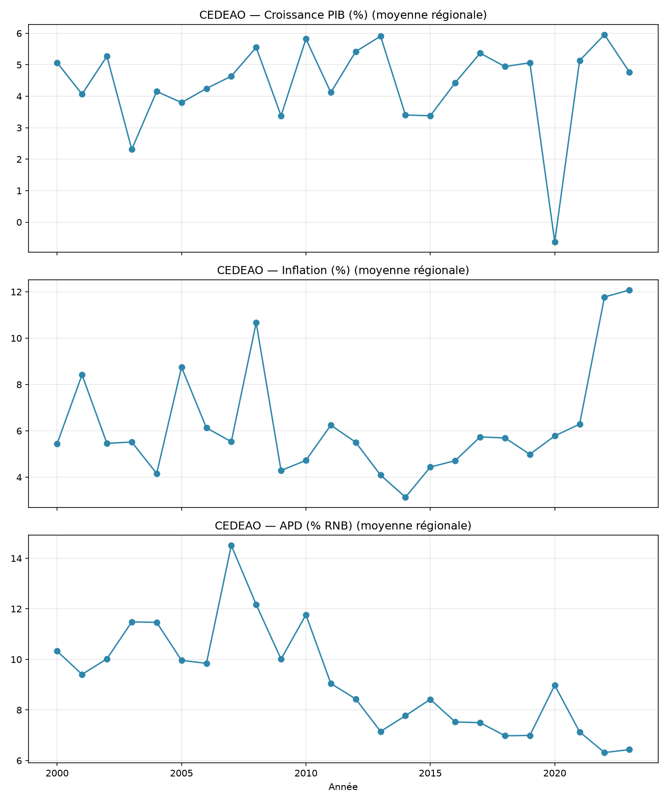
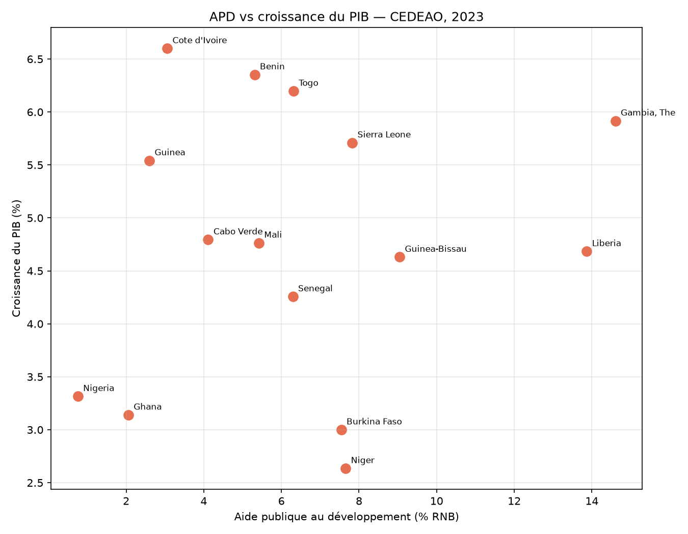

[🇫🇷 Français](README.md) | 🇬🇧 English

# ECOWAS Economic Indicators

A pipeline to fetch and analyze economic and development-aid indicators for
the 15 ECOWAS countries, using the [World Bank API](https://datahelpdesk.worldbank.org/knowledgebase/topics/125589).

## Structure

```
ecowas-development-indicators/
├── data/
│   ├── raw/          # Raw JSON from the API (one file per indicator, generated by fetch_data.py)
│   └── processed/     # Final tidy CSV (generated by clean_data.py)
├── scripts/
│   ├── fetch_data.py  # Calls the World Bank API, handles pagination, caches results
│   ├── clean_data.py  # JSON -> tidy CSV (country x indicator x year)
│   └── analyse.py     # Regional comparisons, rankings, correlations, charts
├── notebook/
│   └── exploration.ipynb
├── ANALYSE.md          # Interpretive write-up of the results (French)
└── outputs/            # Generated charts + report (version-controlled)
```

## Countries covered

Benin, Burkina Faso, Cabo Verde, Côte d'Ivoire, The Gambia, Ghana, Guinea,
Guinea-Bissau, Liberia, Mali, Niger, Nigeria, Senegal, Sierra Leone, Togo.

## Indicators

| World Bank code | Indicator |
|---|---|
| `NY.GDP.MKTP.KD.ZG` | GDP growth (annual %) |
| `NY.GDP.PCAP.CD` | GDP per capita (current US$) |
| `DT.ODA.ODAT.GN.ZS` | Net ODA received (% of GNI) |
| `BX.KLT.DINV.WD.GD.ZS` | Foreign direct investment, net inflows (% of GDP) |
| `FP.CPI.TOTL.ZG` | Inflation, consumer prices (annual %) |
| `DT.DOD.DECT.GN.ZS` | External debt stocks (% of GNI) |

Period: 2000-2023. More indicators can be added by editing the `INDICATEURS`
dictionary in `fetch_data.py`. The full list of codes is searchable here:
https://api.worldbank.org/v2/indicator?format=json&per_page=100&search=<keyword>

## Usage

```bash
python3 -m venv venv
source venv/bin/activate
pip install -r requirements.txt

python scripts/fetch_data.py    # downloads raw data (requires internet, no API key needed)
python scripts/clean_data.py    # generates data/processed/indicateurs_cedeao.csv
python scripts/analyse.py       # generates charts and report in outputs/
```

Or explore step by step in `notebook/exploration.ipynb`.

## Results at a glance

**Growth, inflation and development aid: regional average, 2000-2023**



Regional inflation shifts to a clearly higher regime after 2020-2021, while
official development assistance (ODA) has been on a structural downward
trend since its 2007 peak. See [ANALYSE.md](ANALYSE.md) *(French)* for the
full interpretive write-up.

**Official development assistance vs GDP growth (2023)**



No clear linear relationship emerges between the two — a nuanced reading
rather than a conclusion, discussed further in the analysis.

**[Read the full analysis →](ANALYSE.md)** *(currently in French only)*

## A note on the API

The World Bank API is free and public, but some country/indicator/year
combinations may be missing depending on the country (data coverage is
uneven, especially before the 2000s or for smaller countries). `clean_data.py`
drops missing values rather than guessing them.

## Next steps

- Add other thematic indicator blocks (education, health, digital access) to
  cross-reference with the economic data.
- Build an interactive dashboard (Streamlit).
- Automate periodic data refreshes (World Bank statistics are revised
  several times a year).
- Compare ECOWAS to other regional blocs (CEMAC, SADC...).
- Weight regional trends by each country's economic size rather than a
  simple average.
- Compute an ODA/growth correlation over the full 2000-2023 series instead
  of a single year.

---

*This project was built as part of my learning journey with Python/Pandas,
drawing on my professional background in development program management and
donor partnership coordination.*

---

## License

The code in this project is licensed under [MIT](LICENSE). Data is sourced
from the World Bank ([World Bank Open Data](https://data.worldbank.org)),
licensed under [CC-BY 4.0](https://datacatalog.worldbank.org/public-licenses#cc-by).
